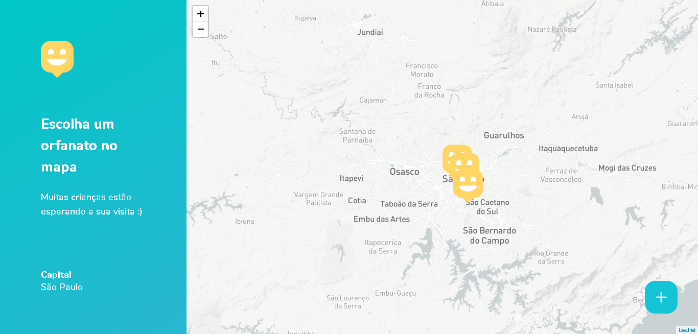

<h1 align="center">
    
</h1>

# 💻 Introdução

O Happy é uma aplicação que conecta pessoas à casas de acolhimento institucional para fazer o dia de muitas crianças mais feliz 💜

## 🚀 Tecnologias

Esse projeto foi desenvolvido com as seguintes tecnologias:

- NodeJS
- ReactJS
- React Native
- Expo
- TypeScript


## 🔖 Layout

Nas imagens abaixo você encontra o layout do projeto.


<br/>


## 📕 Bibliotecas

Esse projeto contem as seguintes bibliotecas:

- Express
- Multer
- Yup
- Typeorm
- Mysql
- Axios

## ⌨ Comandos
````
# Front-End

cd web
yarn install ou npm install
yarn start ou npm run start

# Back-End

cd backend
yarn install ou npm install
yarn dev ou npm run dev

# Mobile

cd mobile
yarn install ou npm install
yarn start ou npm run start
````
